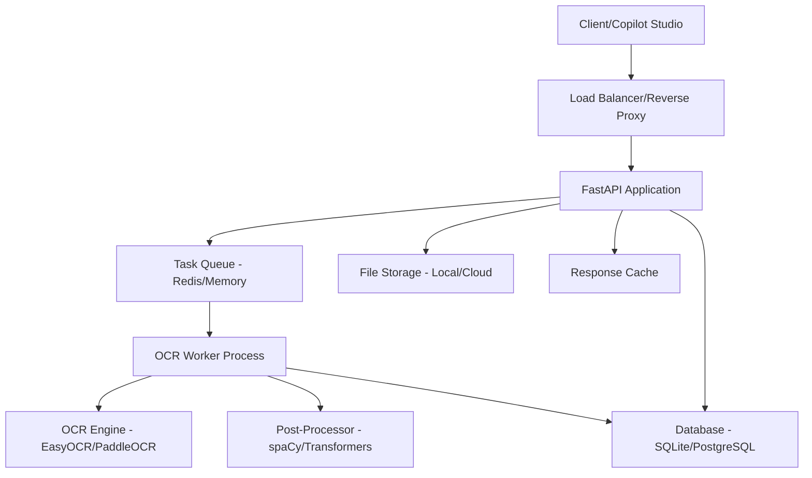

# Design Document - Contract OCR API

## Overview

A Contract OCR API é um sistema especializado para extração e normalização de texto de documentos contratuais em PDF. O sistema utiliza múltiplas técnicas de OCR combinadas com pós-processamento inteligente para maximizar a precisão da extração. A arquitetura é otimizada para deployment em plataformas gratuitas e integração com Copilot Studio.

O sistema processa documentos de forma assíncrona, mantendo rastreamento de status e organizando o conteúdo extraído por páginas com metadados estruturados. A API oferece endpoints RESTful com documentação OpenAPI e suporte a CORS para integração universal.

## Architecture

### High-Level Architecture



### Component Architecture

**API Layer:**
- FastAPI framework para performance e documentação automática
- Pydantic models para validação de dados
- Middleware para CORS, autenticação e rate limiting
- Health check endpoints para monitoramento

**Processing Layer:**
- Task queue para processamento assíncrono (Celery + Redis ou in-memory)
- OCR engine com fallback entre múltiplas bibliotecas
- Post-processing pipeline para normalização e correção
- File management para upload/download seguro

**Storage Layer:**
- Database para metadados e tracking (SQLite para desenvolvimento, PostgreSQL para produção)
- File storage para documentos temporários
- Cache para respostas frequentes

## Components and Interfaces

### API Endpoints

```python
# Upload endpoint
POST /api/v1/documents/upload
Content-Type: multipart/form-data
Response: {"document_id": "uuid", "status": "queued"}

# Status endpoint  
GET /api/v1/documents/{document_id}/status
Response: {"status": "processing|completed|failed", "progress": 0-100}

# Results endpoint
GET /api/v1/documents/{document_id}/results
Response: {"pages": [...], "metadata": {...}}

# Health check
GET /health
Response: {"status": "healthy", "version": "1.0.0"}
```

### Core Interfaces

```python
class OCREngine(Protocol):
    def extract_text(self, pdf_path: str) -> List[PageContent]: ...
    def get_confidence_score(self) -> float: ...

class PostProcessor(Protocol):
    def normalize_text(self, text: str) -> str: ...
    def extract_legal_terms(self, text: str) -> List[str]: ...
    def correct_ocr_errors(self, text: str) -> str: ...

class DocumentStorage(Protocol):
    def save_document(self, file: bytes, document_id: str) -> str: ...
    def get_document(self, document_id: str) -> bytes: ...
    def delete_document(self, document_id: str) -> bool: ...
```

## Data Models

### Core Data Models

```python
from pydantic import BaseModel
from typing import List, Optional, Dict
from datetime import datetime
from enum import Enum

class ProcessingStatus(str, Enum):
    QUEUED = "queued"
    PROCESSING = "processing" 
    COMPLETED = "completed"
    FAILED = "failed"

class BoundingBox(BaseModel):
    x: float
    y: float
    width: float
    height: float

class TextBlock(BaseModel):
    text: str
    confidence: float
    bounding_box: BoundingBox
    font_size: Optional[float] = None
    is_title: bool = False

class PageContent(BaseModel):
    page_number: int
    text_blocks: List[TextBlock]
    raw_text: str
    normalized_text: str
    tables: List[Dict] = []
    images: List[Dict] = []

class DocumentMetadata(BaseModel):
    document_id: str
    filename: str
    file_size: int
    page_count: int
    processing_time: Optional[float] = None
    ocr_confidence: Optional[float] = None
    created_at: datetime
    updated_at: datetime

class ProcessingResult(BaseModel):
    document_id: str
    status: ProcessingStatus
    progress: int
    pages: List[PageContent] = []
    metadata: DocumentMetadata
    error_message: Optional[str] = None
    legal_terms: List[str] = []
```

### Database Schema

```sql
-- Documents table
CREATE TABLE documents (
    id UUID PRIMARY KEY,
    filename VARCHAR(255) NOT NULL,
    file_size INTEGER NOT NULL,
    status VARCHAR(20) NOT NULL,
    progress INTEGER DEFAULT 0,
    page_count INTEGER,
    ocr_confidence FLOAT,
    processing_time FLOAT,
    error_message TEXT,
    created_at TIMESTAMP DEFAULT NOW(),
    updated_at TIMESTAMP DEFAULT NOW()
);

-- Pages table
CREATE TABLE pages (
    id UUID PRIMARY KEY,
    document_id UUID REFERENCES documents(id),
    page_number INTEGER NOT NULL,
    raw_text TEXT,
    normalized_text TEXT,
    confidence FLOAT,
    metadata JSONB
);

-- Text blocks table
CREATE TABLE text_blocks (
    id UUID PRIMARY KEY,
    page_id UUID REFERENCES pages(id),
    text TEXT NOT NULL,
    confidence FLOAT,
    x FLOAT,
    y FLOAT,
    width FLOAT,
    height FLOAT,
    font_size FLOAT,
    is_title BOOLEAN DEFAULT FALSE
);
```

## Correctness Properties

*A property is a characteristic or behavior that should hold true across all valid executions of a system-essentially, a formal statement about what the system should do. Properties serve as the bridge between human-readable specifications and machine-verifiable correctness guarantees.*

### Property Reflection

Após análise das propriedades identificadas no prework, identifiquei algumas redundâncias que podem ser consolidadas:

- **Propriedades 3.1-3.5** (normalização) podem ser combinadas em uma propriedade abrangente de normalização
- **Propriedades 4.1-4.5** (agrupamento por páginas) podem ser consolidadas em propriedades de estrutura e metadados
- **Propriedades 7.1-7.5** (integração) podem ser agrupadas em propriedades de API consistency

### Core Properties

**Property 1: Document Upload Acceptance**
*For any* valid PDF document under 50MB, uploading it should return a unique document ID and queued status
**Validates: Requirements 1.1**

**Property 2: Invalid File Rejection**
*For any* file that is not a valid PDF or exceeds size limits, the upload should be rejected with appropriate error messages
**Validates: Requirements 1.3**

**Property 3: Concurrent Processing Independence**
*For any* set of documents uploaded simultaneously, each should be processed independently with unique IDs and separate status tracking
**Validates: Requirements 1.4**

**Property 4: Text Structure Preservation**
*For any* document with structured content (paragraphs, sections, lists), the extracted text should maintain the original hierarchical structure
**Validates: Requirements 2.2, 3.5**

**Property 5: Image Text Extraction**
*For any* PDF containing images with text, the OCR system should detect and extract text from those images
**Validates: Requirements 2.3**

**Property 6: Text Normalization Consistency**
*For any* extracted text, normalization should remove special characters, standardize spacing, fix line breaks, expand abbreviations, and correct encoding issues
**Validates: Requirements 3.1, 3.2, 3.3, 3.4**

**Property 7: Page-Text Mapping Integrity**
*For any* processed document, there should be a complete mapping between extracted text and original page numbers with positional coordinates
**Validates: Requirements 4.1, 4.5**

**Property 8: JSON Structure Consistency**
*For any* API response containing document results, the JSON should include page indices, text blocks, and metadata in the specified format
**Validates: Requirements 4.2, 7.1**

**Property 9: Legal Term Processing**
*For any* text containing legal terminology, the post-processing should validate and correct legal terms appropriately
**Validates: Requirements 5.3**

**Property 10: Queue Management Under Load**
*For any* number of simultaneous requests, the system should manage processing through a queue without losing or duplicating tasks
**Validates: Requirements 6.3**

**Property 11: API Response Standards**
*For any* API request, responses should follow HTTP standards with appropriate status codes, error messages, and CORS headers
**Validates: Requirements 7.3, 7.5**

**Property 12: Authentication Consistency**
*For any* request with valid API key, access should be granted; for invalid or missing keys, access should be denied with 401 status
**Validates: Requirements 7.2**

**Property 13: Status Tracking Completeness**
*For any* uploaded document, a unique tracking ID should be provided and status should be queryable throughout the processing lifecycle
**Validates: Requirements 8.1, 8.2**

**Property 14: Processing Completion Notification**
*For any* completed processing task, notification should be available through status endpoint or webhook mechanism
**Validates: Requirements 8.3**

**Property 15: Error Logging Comprehensiveness**
*For any* processing error, detailed logs should be created with sufficient information for debugging and troubleshooting
**Validates: Requirements 8.4**

## Error Handling

### Error Categories

**Validation Errors (400 series):**
- Invalid file format or corrupted PDF
- File size exceeding limits
- Missing required parameters
- Invalid API key format

**Processing Errors (500 series):**
- OCR engine failures
- Post-processing timeouts
- Database connection issues
- Storage system failures

**Rate Limiting (429):**
- Too many requests per time window
- Queue capacity exceeded
- Resource exhaustion

### Error Response Format

```json
{
  "error": {
    "code": "INVALID_FILE_FORMAT",
    "message": "The uploaded file is not a valid PDF document",
    "details": {
      "file_type_detected": "image/jpeg",
      "expected_type": "application/pdf"
    },
    "timestamp": "2024-01-15T10:30:00Z",
    "request_id": "req_123456"
  }
}
```

### Retry and Fallback Strategies

- **OCR Engine Fallback:** EasyOCR → PaddleOCR → Tesseract
- **Post-processing Fallback:** Advanced NLP → Rule-based normalization
- **Storage Fallback:** Primary storage → Backup storage → Local temporary
- **Queue Fallback:** Redis → In-memory queue → Direct processing

## Testing Strategy

### Dual Testing Approach

The system requires both unit testing and property-based testing for comprehensive coverage:

**Unit Tests:**
- Specific examples demonstrating correct behavior
- Integration points between components  
- Edge cases and error conditions
- API endpoint functionality

**Property-Based Tests:**
- Universal properties across all valid inputs
- OCR accuracy and consistency properties
- Data integrity and structure preservation
- API contract compliance

### Property-Based Testing Framework

**Framework:** Hypothesis (Python)
- Minimum 100 iterations per property test
- Custom generators for PDF documents, text content, and API requests
- Shrinking capabilities for minimal failing examples

**Test Configuration:**
```python
from hypothesis import given, strategies as st, settings

@settings(max_examples=100, deadline=30000)
@given(pdf_document=pdf_generator())
def test_document_upload_acceptance(pdf_document):
    """**Feature: contract-ocr-api, Property 1: Document Upload Acceptance**"""
    # Test implementation
```

### Unit Testing Framework

**Framework:** pytest with fixtures
- FastAPI test client for endpoint testing
- Mock objects for external dependencies
- Database fixtures for data layer testing
- File system fixtures for document handling

### Test Data Strategy

**Synthetic Test Documents:**
- Generated PDFs with known content for accuracy testing
- Documents with various layouts, fonts, and quality levels
- Edge cases: empty pages, image-only pages, corrupted sections

**Real-world Samples:**
- Anonymized contract samples for integration testing
- Various document qualities and formats
- Multi-language content for internationalization testing

### Performance Testing

**Load Testing:**
- Concurrent upload scenarios
- Queue capacity testing
- Memory usage under load
- Response time benchmarks

**Stress Testing:**
- Large document processing (100 pages)
- High-resolution image handling
- Extended processing time scenarios
- Resource exhaustion recovery